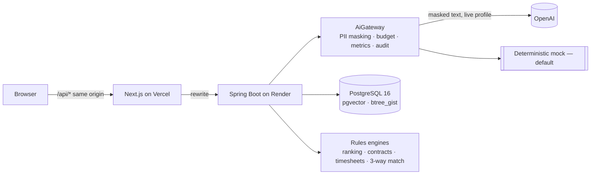

# Flowpanel

**From the first email to the last invoice, one workflow.**

Flowpanel is a mini vendor management system (VMS) for temporary staffing. Each mission moves through six gated phases —
**Intake → Sourcing → Contracts → Timesheets → Invoice → Closed** — and several missions run in parallel, each on its own track.
An AI layer helps at every phase: **the AI drafts, rules decide, a person approves.**

> Demo project built for a job application. Not affiliated with Pixid. All people, companies and data are synthetic.

- **Live demo**: _https://flowpanel.vercel.app_ (placeholder — see [docs/deployment.md](docs/deployment.md)); pick a persona, no sign-up.
- **Demo script**: [docs/demo-script.md](docs/demo-script.md) · **Architecture**: [docs/architecture.md](docs/architecture.md) ·
  **ADRs**: [docs/adr](docs/adr) · **Run log**: [PROGRESS.md](PROGRESS.md)

| Board | Mission workflow | Admin AI monitoring |
|---|---|---|
| _screenshot placeholder_ | _screenshot placeholder_ | _screenshot placeholder_ |

## Run it locally in 3 commands

Requirements: Docker, Java 21, Node 22+ (24 recommended), Python 3.11+ (for evals), GNU Make + bash (Git Bash on Windows).

```bash
cp .env.example .env          # optional: defaults work; AI_PROFILE=mock needs no key
make db-up                    # PostgreSQL 16 + pgvector on localhost:5433
make dev                      # backend on :8080 (mock AI) + frontend on :3000
```

Open <http://localhost:3000>, click **Try the live demo** and choose a persona:
**Claire** (LogiNord buyer), **Marc** (MétalPro buyer), **Nadia** (InterSud Intérim supplier), **Thomas** (Proxi Staffing supplier),
**Alex** (platform admin). Demo data is seeded on first start; admin → *Reset demo data* restores it.

Without Make: `docker compose up -d` · `cd backend && ./mvnw spring-boot:run` · `cd frontend && npm install && npm run dev`.

To use OpenAI instead of the deterministic mock: set `AI_PROFILE=live` and `OPENAI_API_KEY` in `.env` (daily budget `AI_DAILY_BUDGET_USD`, default $2).

## Tests and evals

```bash
make test       # backend ./mvnw verify (unit + Testcontainers integration tests) and frontend lint, typecheck, Vitest
make eval       # throwaway DB + backend in mock profile + the full eval suite (exit 1 below thresholds)
cd frontend && npm run build && npm run test:e2e   # Playwright smoke tests (backend running on :8080)
```

The eval suite ([evals/README.md](evals/README.md)) scores intake field accuracy, invoice line accuracy, retrieval hit rate, citation
validity, answer accuracy, tool choice and tool answers against golden datasets; results appear on the admin dashboard and gate CI.

## Architecture



- **Backend**: Java 21, Spring Boot 3.5, Spring Security (JWT in an httpOnly cookie), Spring Data JPA, Flyway, springdoc
  (Swagger UI at `/swagger-ui`), Spring AI 1.1 (OpenAI). Package by feature; RFC 7807 errors; failed gates → 409 with the unmet checks.
- **Frontend**: Next.js 16 App Router, TypeScript strict, Tailwind CSS 4, shadcn/ui, TanStack Query, Framer Motion, Recharts; API
  types generated from the OpenAPI spec.
- **Data**: PostgreSQL 16 with pgvector (HNSW) for RAG and matching, and an exclusion constraint against double booking.

## Features by phase

| Phase | AI does | Rules / people decide |
|---|---|---|
| **Intake** | Extracts the order from the email (JSON-schema structured output) with a confidence per field | Server-side validation; hedged or invalid fields must be confirmed; gate: nothing left to review |
| **Sourcing** | One-sentence summary of top candidates; embedding similarity | Hard rules exclude (certificate, availability, overlapping placement); weighted score; ✓/✗ explanations; DB-enforced double-booking protection; a person selects |
| **Contracts** | Drafts the contract text | Rules: rate, legal reason, certificate, dates; one-click fixes; simulated e-signature |
| **Timesheets** | Explains each anomaly from the daily breakdown | Rules: contracted hours, weekly maximum, daily limit; approve overtime or return to supplier; approved hours computed in Java |
| **Invoice** | Reads the supplier PDF into lines; drafts the French credit-note request | Three-way match (contract rate × approved hours vs invoice) in BigDecimal; credit note; approval |
| **Closed** | — | Summary: workers placed, hours, amount, overbilling avoided, AI steps reviewed |
| **Copilot** | Tool calling and document Q&A | Tools and retrieval scoped to the caller's tenant / supplier; citations verified against retrieved passages |

Across the board: tenant and supplier isolation (404 for out-of-scope ids), PII masked before any model call, every AI call metered
(`ai_call`: model, tokens, latency, cost) and every AI suggestion and human decision in the audit trail, daily AI budget and rate limit.

## Project structure

```
backend/     Spring Boot app (src/main/java/com/flowpanel/<feature>), Flyway migrations, Dockerfile
frontend/    Next.js app: landing page (/), demo login (/login), product (/app), Playwright e2e
evals/       Python eval runner, golden datasets, thresholds
docs/        architecture.md, adr/, deployment.md, demo-script.md
.github/     CI (tests + eval gate + e2e), live evals (manual), deploy (Render hook)
docker-compose.yml · Makefile · render.yaml · CLAUDE.md · PROGRESS.md
```

## Deployment

Neon (Postgres + pgvector) · Render (backend Docker image, free plan) · Vercel (frontend) · GitHub Actions. Step by step:
[docs/deployment.md](docs/deployment.md).
