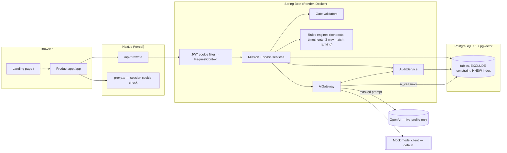
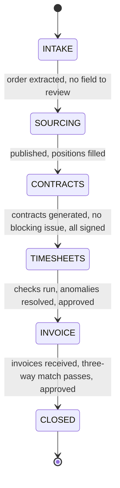
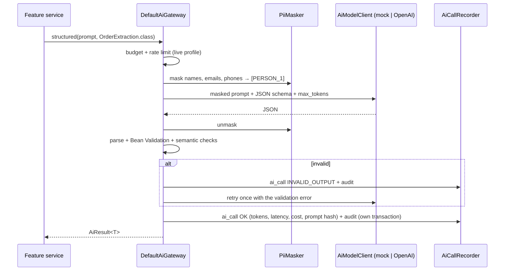
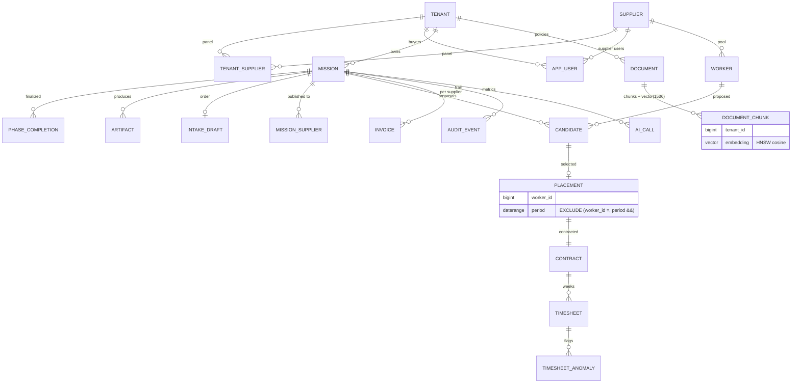

# Architecture

Flowpanel is a mini vendor management system (VMS) for temporary staffing. A **mission** moves through six phases —
Intake → Sourcing → Contracts → Timesheets → Invoice → Closed — and each phase opens only when the previous phase's **gate** passes and
a person finalizes it. An AI layer helps at every phase, but never decides.

## Components

| Layer | Technology | Notes |
|---|---|---|
| Frontend | Next.js 16 (App Router), TypeScript strict, Tailwind 4, shadcn/ui, TanStack Query, Framer Motion, Recharts | Calls only `/api/*` (same origin), types generated from OpenAPI |
| Backend | Java 21, Spring Boot 3.5, Spring Security, Spring Data JPA + JdbcTemplate, Flyway, springdoc | Package by feature |
| AI | Spring AI 1.1 (OpenAI chat with JSON-schema outputs, tools, embeddings) | Behind `AiGateway`; `mock` profile by default |
| Data | PostgreSQL 16, pgvector (HNSW, cosine), btree_gist (exclusion constraint) | Neon in production, Docker locally |
| Quality | JUnit 5, AssertJ, Testcontainers, Vitest, Testing Library, Playwright, Python eval suite | Evals are a CI gate |

Backend packages: `tenant`, `auth`, `mission` (state machine, gates, artifacts), `intake`, `sourcing`, `contract`, `timesheet`,
`invoice` (+ closing summary), `copilot` (RAG + tools), `ai` (gateway, masking, metrics, mock and live clients), `audit`, `metrics`
(admin dashboard), `demo` (seeder and reset).

## Request flow

1. The browser calls `/api/missions/42/contracts/sign` on the Vercel origin; Next rewrites it to `${BACKEND_URL}/missions/42/contracts/sign`.
   The `fp_session` cookie (httpOnly, SameSite=Lax, signed HS256 JWT) travels with it.
2. `JwtCookieAuthFilter` validates the token and puts a `CurrentUser` (user, role, tenantId, supplierId) in the security context.
3. The controller calls the feature service. Every phase-specific write starts with
   `MissionService.requireCurrentPhase(id, Phase.CONTRACTS)`: it loads the mission **of the caller's tenant** with a row lock and returns
   409 if the mission is in another phase (404 if it belongs to another tenant).
4. The service applies deterministic rules, calls the AI gateway when it needs a draft or an extraction, writes artifacts and audit events.
5. Finalizing a phase: `GateRegistry` evaluates the phase's `GateValidator`; unmet checks → 409 with `unmetChecks`. Otherwise a
   `phase_completion` row is written, `PhaseFinalized` / `PhaseEntered` events let feature modules close and open their phase
   (e.g. timesheets are generated when TIMESHEETS opens, the summary when CLOSED opens), all in the same transaction.
6. Errors are RFC 7807 `ProblemDetail`; the UI shows `detail` (and `unmetChecks`).

## Phase state machine

`Phase` holds an explicit allowed-transitions map; `Mission.transitionTo` rejects anything else. The board's "next action" and
"Needs review" tag come from the same gate evaluation (a failing check flagged `needsReview` means a person must look at something).

## Tenant and supplier scoping

- **Buyers** (`BUYER`) belong to a tenant. Every repository query on missions and their data filters by `tenant_id` from the session.
- **Supplier users** (`SUPPLIER`) belong to a supplier. They reach only orders published to their supplier (`mission_supplier`), and
  inside those only their own candidates, placements, invoices and contracts (`supplier_id` filter in SQL).
- **Admin** sees platform metrics and the audit explorer, not mission screens.
- Out-of-scope ids answer **404, not 403**, so a caller cannot probe which ids exist (`IsolationIT`, `MissionIT`).
- The copilot's tools read the scope from the session, so arguments chosen by the model can narrow a query but never widen it
  (`CopilotIT`: a supplier asking for a competitor's rates with a prompt injection gets only its own row).
- Document retrieval filters `tenant_id` **in the same SQL statement** as the vector ordering, with
  `hnsw.iterative_scan = relaxed_order` so the filter cannot starve the HNSW index.
- Double booking is impossible at the database level: `placement` has
  `EXCLUDE USING gist (worker_id WITH =, period WITH &&)`; concurrent selections yield exactly one success (`SourcingIT`).

## AI gateway

- One implementation (`DefaultAiGateway`) for both profiles; only the provider client changes, so masking, retries, spend protection and
  metrics are exercised by every test.
- `mock` (default): deterministic responders per prompt template id (a rule-based French email parser, an invoice-text parser, a keyword
  tool router, template drafts), hash-based 1536-d embeddings, simulated tokens and latency.
- `live`: Spring AI `OpenAiChatModel` with JSON-schema structured outputs (`BeanOutputConverter`), function calling (`ToolCallback`),
  `OpenAiEmbeddingModel`. Model names come from configuration.
- Spend protection: `AI_DAILY_BUDGET_USD` from `ai_call` cost records, per-tenant rate limit, `max_tokens` on every call, typed errors
  (`ai_budget_exceeded`, `ai_rate_limited`, `ai_invalid_output`, `ai_provider_error`).
- Embeddings are cached by `(content hash, model)` in `embedding_cache`.

## Data model

Migrations: `V1` extensions · `V2` tenancy, users, audit · `V3` workers, templates, missions, artifacts · `V4` ai_call, embedding cache,
known contacts · `V5` intake · `V6` sourcing · `V7` contracts · `V8` timesheets · `V9` invoices · `V10` documents · `V11` eval runs.
